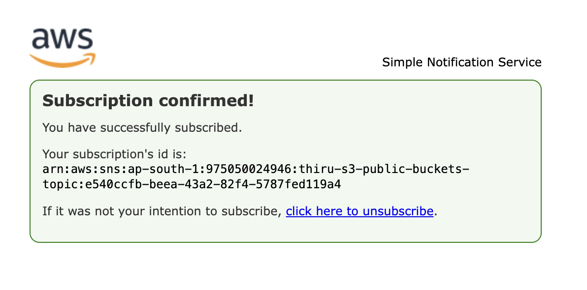
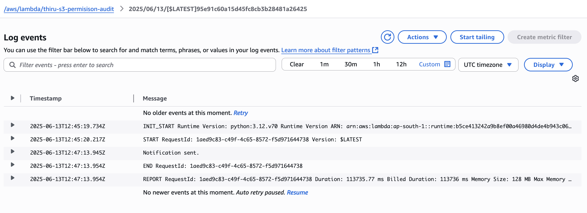

# 🛡️ S3 Public Bucket Audit Lambda

This AWS Lambda function automatically audits all S3 buckets in your AWS account and sends an email alert via SNS if any buckets have **public read or write access**. It helps you enforce security best practices by detecting overly permissive bucket configurations.

---

## 📌 Features

- ✅ Lists all S3 buckets in the account
- 🔍 Checks each bucket’s ACL and bucket policy for public access
- 📧 Sends an SNS email alert if any bucket is publicly accessible
- 🔁 Scheduled to run daily using CloudWatch Events

---

## 🛠️ Setup Instructions

### 1. SNS Setup

1. Go to **Amazon SNS → Create topic**
2. Type: `Standard`  
   Name: `S3PublicBucketAlert`
3. Copy the **Topic ARN**
4. Create a **subscription** to the topic:  
   - Protocol: `Email`  
   - Endpoint: Your email address  
5. Confirm the subscription from your inbox

---

### 2. IAM Role for Lambda

Create a new IAM role for your Lambda function with the following **custom inline policy**:

```json
{
  "Version": "2012-10-17",
  "Statement": [
    {
      "Effect": "Allow",
      "Action": [
        "s3:ListAllMyBuckets",
        "s3:GetBucketAcl",
        "s3:GetBucketPolicy",
        "s3:GetBucketPolicyStatus",
        "sns:Publish"
      ],
      "Resource": "*"
    }
  ]
}
```

### 3. Lambda Function

- Runtime: Python 3.9+
- Environment Variable: SNS_TOPIC_ARN with your SNS topic ARN

### 4. Schedule with CloudWatch

- Go to CloudWatch > Rules > Create Rule
- Event Source → Schedule → rate(1 day)
- Target → Select your Lambda function
- Click Create

### 5. Testing

- Make a test bucket public:
    - S3 → Select bucket → Permissions → Edit ACL or Policy
- Go to Lambda → Click Test (use any test event)

You should receive an alert email if public access is detected.

## Outputs

### Subscribe to the SNS Topic

Email received for accepting SNS topic


SNS topic Accepted Message



### Cloud Watch Log

Once the Test trigger is made the Cloud Watch will be capturing this log




### Email received 

Email is received with the list of public buckets

